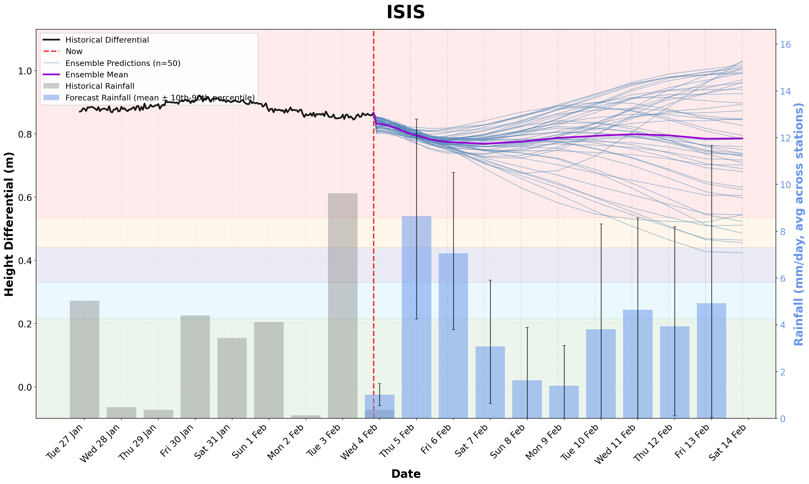
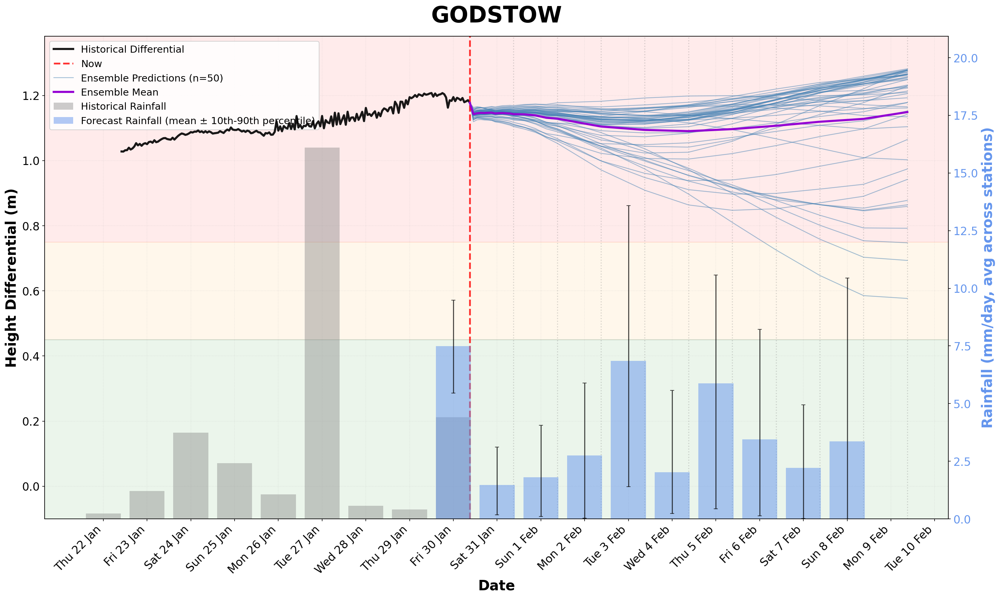
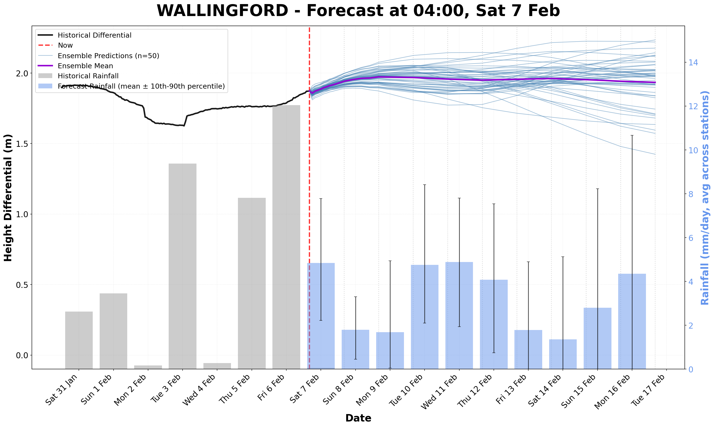

# Flag Predictor 

This is an LSTM AI model that predicts the river differential levels along the Thames, which acts a proxy for the river flow speed. The differential is the difference in river height between the upstream and downstream locks for a given stretch, which is how the OURCs flag is set at Godstow and usually closely tracks the flag on the Isis. This model has been trained on upstream rainfall data for the Isis, Godstow and the Wallingford stretches. Predictions are made using rainfall forecasts and features derived from recent rainfall. The model generates 10-day probablistic forecasts to help determine the differential. Please consider this experimental and a work in progress!

## Latest Forecast Plots

### Isis


### Godstow


### Wallingford


## Features

- **Multi-location support**: Train and predict for Isis or Godstow or Wallingford Stretches
- **10-day forecasts**: Predicts from 2 hours to 240 hours ahead
- **Ensemble predictions**: Probabilistic forecasts using multiple rainfall scenarios from different rainfall ensemble members


## Installation

### Prerequisites

- Python 3.10+ 
- PyTorch 2.0+ (with MPS support for Apple Silicon)

### Install from source

```bash
# Clone the repository
git clone https://github.com/yourusername/flag-predictor.git
cd flag-predictor

# Create virtual environment
python -m venv .venv
source .venv/bin/activate  # On Windows: .venv\Scripts\activate

# Install the package
pip install -e .

# Or with development dependencies
pip install -e ".[dev,notebook]"
```

## Quick Start

### Command Line Interface

```bash
# Train a model for the Isis
flag-predictor train --location isis

# Train a model for Godstow
flag-predictor train --location godstow

# Train a model for Wallingford
flag-predictor train --location wallingford


# Run an ensemble forecast
flag-predictor forecast --location isis --ensemble

# Run a single forecast and save to CSV
flag-predictor forecast --location isis --output forecast.csv
```

### Python API

```python
from flag_predictor import get_location_config
from flag_predictor.pipeline import train_location_model, run_forecast

# Train a model
model, config = train_location_model(location='isis')

# Run a forecast
results = run_forecast(location='isis', ensemble=True, n_members=20)

# Access results
predictions = results['predictions']
statistics = results['statistics']
flag_probs = results['flag_probabilities']

print(f"Mean prediction: {statistics['mean'].iloc[-1]:.3f}m")
print(f"Red flag probability: {flag_probs['p_red'].iloc[-1]*100:.1f}%")
```

### Using Individual Components

```python
from flag_predictor.data import fetch_all_api_data, get_rainfall_forecast_ensemble
from flag_predictor.processing import merge_and_clean_data, create_target_and_features
from flag_predictor.models import train_model, load_model
from flag_predictor.prediction import predict_ensemble, compute_flag_probabilities

# Load data
river_levels, rainfall = fetch_all_api_data()

# Load trained model
model, scaler, config = load_model(models_dir='models')

# Make predictions
predictions = predict_ensemble(model, scaler, ...)
```

## Project Structure

```
flag_predictor/
├── src/
│   └── flag_predictor/
│       ├── __init__.py          # Package initialization
│       ├── config.py            # Location configs, API URLs, hyperparameters
│       ├── cli.py               # Command-line interface
│       ├── pipeline.py          # High-level pipeline functions
│       ├── data/
│       │   ├── api.py           # API data fetching
│       │   └── loader.py        # CSV loading utilities
│       ├── processing/
│       │   ├── cleaning.py      # Data cleaning and merging
│       │   └── features.py      # Feature engineering
│       ├── models/
│       │   ├── lstm.py          # LSTM model definition
│       │   └── training.py      # Training and model I/O
│       └── prediction/
│           └── forecast.py      # Forecasting functions
├── notebooks/
│   └── visualization.ipynb      # Plotting and analysis
├── data/
│   ├── isis_flag_model_data.csv
│   ├── godstow_flag_model_data.csv
│   └── rainfall_training_data/
├── models/                      # Saved model weights
├── pyproject.toml
└── README.md
```

## Configuration

### Switching Locations

The system supports both Isis, Godstow, and and Wallingford.

```python
from flag_predictor.config import get_location_config

# Get ISIS config
isis_config = get_location_config('isis')

# Get Godstow config  
godstow_config = get_location_config('godstow')
```

### Model Hyperparameters

Default hyperparameters in `config.py`:

```python
MODEL_CONFIG = {
    'sequence_length': 120,      # 5 days of history
    'hidden_sizes': [192, 128, 64],
    'dropout_rate': 0.3,
    'catchment_lag': 18,         # Hours for rain to affect river
}

TRAINING_CONFIG = {
    'epochs': 30,
    'batch_size': 64,
    'learning_rate': 0.0001,
    'patience': 7,
}
```

## Data Sources

- **River Levels**: Environment Agency Flood Monitoring API
- **Historical Rainfall**: Environment Agency rain gauge data
- **Rainfall Forecasts**: Open-Meteo Ensemble API (ICON model)

## Downloading Training Data

The training data CSV files are not included in the repository due to their large size (several hundred MB). You can download all required CSV files using the provided scripts:

### Download All Data

```bash
# Download all rainfall data (for all stations)
python -m flag_predictor.data.download_rainfall

# Download all river level data
python -m flag_predictor.data.download_level

# Download flow data
python -m flag_predictor.data.download_flow

# Download groundwater data
python -m flag_predictor.data.download_groundwater
```

### Download Individual Stations

You can also download data for specific stations:

```python
from flag_predictor.data.download_rainfall import download_station_rainfall
from flag_predictor.data.download_level import download_station_level

# Download rainfall for a specific station
download_station_rainfall(
    station_name='Osney',
    measure_id='{uuid}-rainfall-t-900-mm-qualified',
    min_date='2017-01-01'  # Optional: filter by date
)

# Download level data for a specific station
download_station_level(
    station_name='Osney',
    measure_id='{uuid}-level-i-900-m-qualified',
    min_date='2017-01-01'
)
```

### Wallingford-Specific Stations

For Wallingford location, download the additional 6 stations:

```bash
python download_wallingford_rainfall.py
```

### Data Directory Structure

After downloading, your `data/` directory should contain:

```
data/
├── isis_flag_model_data.csv
├── godstow_flag_model_data.csv
├── wallingford_flag_model_data.csv
├── rainfall_training_data/
│   ├── Osney-rainfall-15min-Qualified.csv
│   ├── Eynsham-rainfall-15min-Qualified.csv
│   └── ... (other station files)
├── level_training_data/
│   ├── Eynsham-Lock-level-15min-Qualified.csv
│   └── ... (other level station files)
├── flow_training_data/
│   └── Farmoor-flow-15min-Qualified.csv
└── groundwater_training_data/
    └── SP50_72-groundwater-15min-Qualified.csv
```

**Note**: The CSV files are large (50-57MB each for rainfall data). The download scripts handle pagination automatically and may take several minutes to complete.

## Development

```bash
# Install dev dependencies
pip install -e ".[dev]"

# Run tests
pytest

# Format code
black src/
ruff check src/

# Type checking
mypy src/
```

## License
Anyone can do whatever they'd like with it!

## Acknowledgments

- Environment Agency for river level and rainfall data
- Open-Meteo for rainfall forecast API
- Anu and the creators of flags.jamesonlee.com for providing the flag colour backgrounds and inspiring this 
