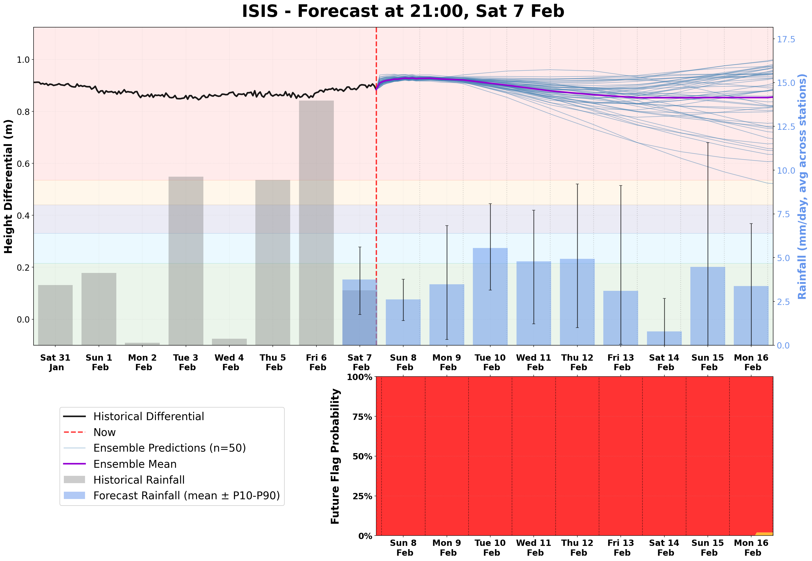
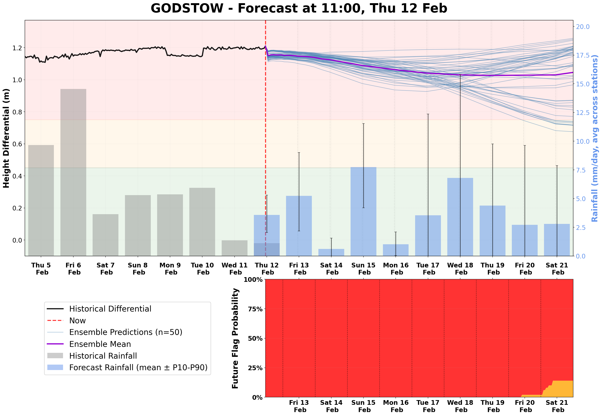
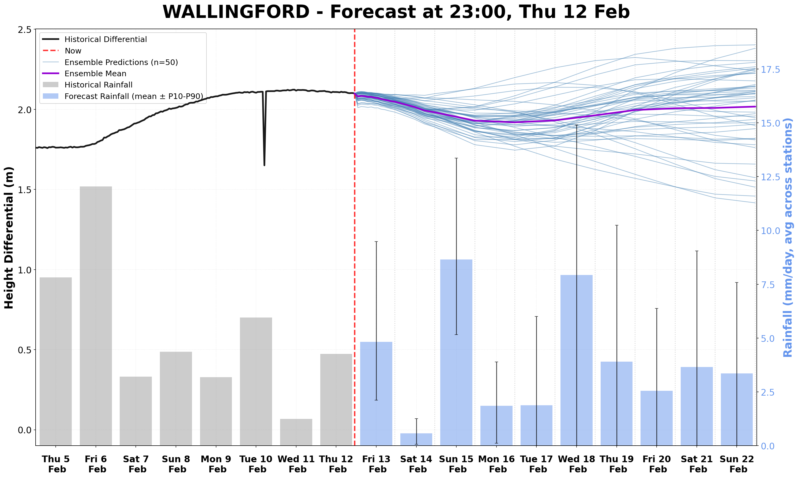

# Latest Experimental Forecasts

## Isis

## Godstow

## Wallingford

### How do I understand the plots?
The top plots are 10-day forecasts of the river height differential (related to the flow speed) for the Isis, Godstow, and Wallingford stretches. The river is most likely to follow the purple (mean) trajectory, but we could end up on any of the blue ones depending on how much rain we actually get. Plots update automatically every hour, with new rainfall forecasts incorporated as soon as they are released. The lower right plot shows the probabilities associated with the river being in each flag 'band' at each point in the forecast (no flag at Wallingford).

### Where is the data from?
The Environment Agency's API provides the historical rainfall and the historical differential levels on which the model has been trained. This is also where the data from the last 10 days comes from, as shown on the plots. The rainfall forecasts come from the European Center for Medium Range Weather Forecasts' AI Forecasting System (ECMWF-AIFS). If you wish to clone the GitHub repo, you can very easily change the forecast data source to others also provided by the Open-Meteo API.

### Why hasn't the forecast updated recently?
Normally this is just because of a temporary glitch in the data stream: often one of the river sensors will go offline briefly. This usually resolves quickly but can take a while: it will just display the most recently created forecast in the meantime. Also, the code to update the forecasts sometimes can sit in a queue for a while on the GitHub servers, which is why it doesn't update exactly on the hour every hour.

### Are there any known issues?
The forecast is definitely not perfect, please treat it as experimental! The biggest issue with the model currently (01/02/2026) is the weird jump it often displays at the start of the forecast. Occasionally I write about issues with the model and improvements I am hoping to make here: https://robertdoanesolomon.substack.com - if there are any other problems, if you have ideas of fixes, or other things that might be good to see, feel free to open an issue on GitHub.
